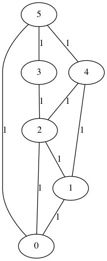
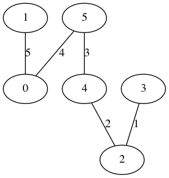
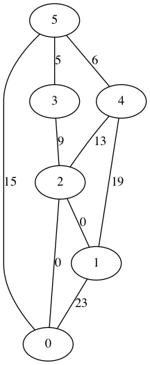

This is an algorithm to compute the betweenness centrality of a of an 
unweighted undirected graph.

The graph is represented as a symmetric adjecency list.  We generate a 
random spanning tree rooted at each node in the graph.  The weight of each
edge in the tree is the recursive sum of the weights of its child edges.
If an edge has no child edges, its weight is 1.  The betweenness centrality
of an edge is the sum of its weights in each of the spanning trees.  
A random spanning tree is generated by starting at a given root and 
perfoming depth first search.  Starting from a given node, the order that
each neighbor is vistited is randomized by shuffling its adjcency list.


start with a graph like this



generate a random spanning tree for each vertex.  This on starts at vertex 1.



weigh each edge with the sum of its weights in each tree.



The visualizations are created with graphviz

```bash
brew install graphviz
```

use `make` to build or `make run` to build and run. 


